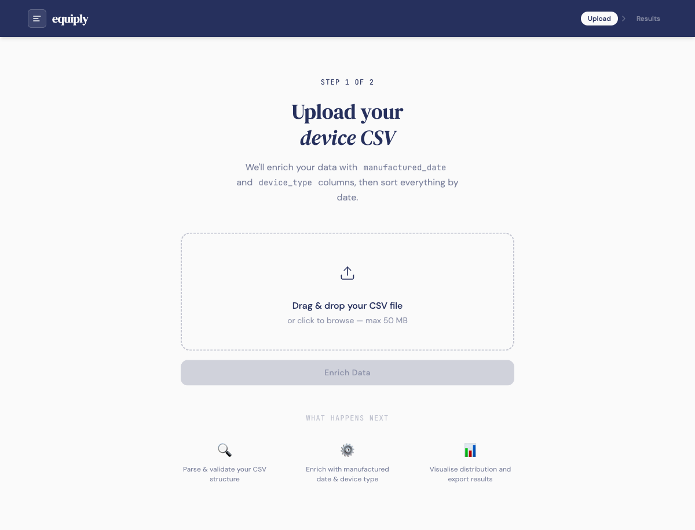
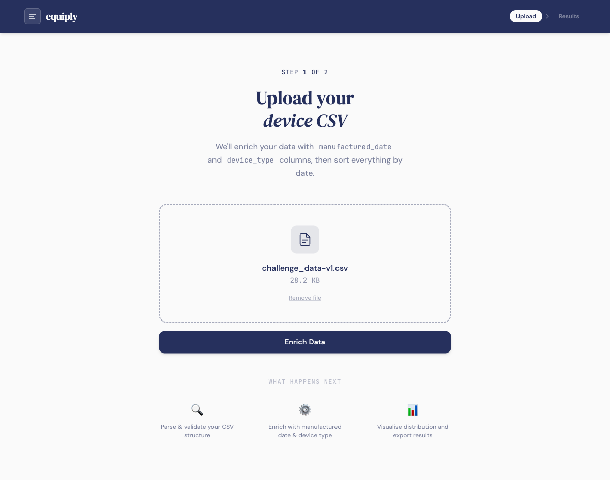
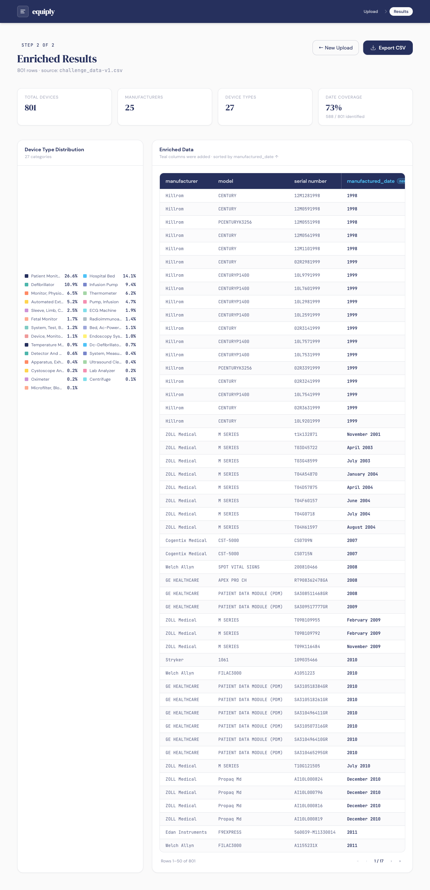

# Equiply — Device Data Enrichment

A React + FastAPI application that takes a raw medical device inventory CSV and enriches it with two derived columns — `manufactured_date` and `device_type` — then surfaces the results as a sortable table and an interactive pie chart.

---

## 3-Hour Build Timeline

> Built during the Equiply engineering challenge window.

```
┌─────────────────────────────────────────────────────────────────────┐
│  Hour 1 — Cracking the Serial Number Problem                        │
├─────────────────────────────────────────────────────────────────────┤
│                                                                     │
│  Started with ZOLL Medical — the most complex encoding in the set.  │
│                                                                     │
│  Reverse-engineered their serial number DOM format:                 │
│                                                                     │
│    AF23G169205                                                      │
│    ├── AF      → product type code (2 chars)                        │
│    ├── 23      → year (YY → 2023)                                   │
│    ├── G       → month (A=Jan … L=Dec, so G=July)                   │
│    └── 169205  → unit UID (6+ digits)                               │
│                                                                     │
│  Two parsing strategies considered:                                 │
│  · Forward: read product code from left, then YY+month             │
│  · Backward: strip 6-digit UID from right, validate remainder       │
│  → Forward approach chosen (cleaner, fewer edge cases)              │
│                                                                     │
│  Key insight: every manufacturer encodes the date somewhere in      │
│  the serial — the encoding just differs. ZOLL was the hardest.      │
│  Once cracked, the pattern for others became obvious.               │
│                                                                     │
│  Used AI to generalize across all 24 manufacturers in the dataset.  │
│  Patterns ranged from trivial (LINET: starts with YYYY) to subtle   │
│  (GE Healthcare: prefix map SA3YY, SPXYY, RTSYY, RT9YY → 20YY).   │
│                                                                     │
│  Built manufacturer-specific decoder functions using OOP            │
│  principles — each decoder is isolated, independently testable,     │
│  and trivially extensible when new vendors are added.               │
│                                                                     │
└─────────────────────────────────────────────────────────────────────┘
┌─────────────────────────────────────────────────────────────────────┐
│  Hour 2 — Device Type + Full Stack Wiring                           │
├─────────────────────────────────────────────────────────────────────┤
│                                                                     │
│  Added device_type enrichment via two-tier lookup:                  │
│  · Tier 1: openFDA 510k API — official FDA classification string    │
│    for models that have a clearance record by exact name            │
│  · Tier 2: keyword fallback — covers the ~57% of models the         │
│    FDA 510k database doesn't index by brand name                    │
│                                                                     │
│  Built the FastAPI backend:                                         │
│  · POST /api/enrich  → enriched JSON rows + decoder_logic map       │
│  · POST /api/enrich/download  → streams enriched CSV directly       │
│  · GET /*  → serves the built React SPA in production               │
│                                                                     │
│  Wired data_parser.py into the API without modifying the file —     │
│  exec'd it with mocked read_csv/display so the Colab script         │
│  lines run harmlessly on import.                                    │
│                                                                     │
└─────────────────────────────────────────────────────────────────────┘
┌─────────────────────────────────────────────────────────────────────┐
│  Hour 3 — React UI + Diagnostic Features                            │
├─────────────────────────────────────────────────────────────────────┤
│                                                                     │
│  Built the Equiply-themed React app (brand: #26305D / #FAFAFA):    │
│  · Upload page with drag-and-drop CSV zone                          │
│  · Results page with stats strip, pie chart, paginated table        │
│                                                                     │
│  Added two diagnostic features to make the data trustworthy:        │
│                                                                     │
│  1. Outlier highlighting                                            │
│     Rows where the decoded date looks suspicious (year in the       │
│     future, implausible P3200 prefix match, etc.) are highlighted   │
│     amber in the table. Hovering the ⚠ icon shows the exact        │
│     reason — which part of the serial was misread and why.          │
│                                                                     │
│  2. Decoder-logic tooltips on the pie chart                         │
│     Hovering any device type slice shows which manufacturers         │
│     contribute to it and, for each, the exact serial decode logic   │
│     (e.g. "Product code + 2-digit year + month letter A=Jan…L=Dec"  │
│     for ZOLL). Turns the chart into a decode confidence audit.      │
│                                                                     │
└─────────────────────────────────────────────────────────────────────┘
```

---

## Screenshots

### Upload — drag & drop or browse



### Upload — file selected, ready to enrich



### Results — enriched table, pie chart, stats, export



---

## How to Run

```bash
# 1. Install Python dependencies
python3 -m venv .venv
.venv/bin/pip install -r requirements.txt

# 2. Dev mode (hot-reload frontend + backend separately)
cd frontend && npm install && npm run dev   # Vite on :5173, proxies /api → :8000
.venv/bin/uvicorn main:app --port 8000 --reload

# 3. Production (serve everything from FastAPI at /)
cd frontend && npm run build               # outputs to ../static/
.venv/bin/uvicorn main:app --port 8000
```

---

## Data Transformation Pipeline

When a CSV is uploaded to `POST /api/enrich`, it goes through four sequential steps in `main.py`:

```
Raw CSV upload
      │
      ▼
┌─────────────────────────────────────────────────────┐
│  Step 1 — Parse                                     │
│  pd.read_csv on the uploaded bytes.                 │
│  Expected columns: manufacturer, model,             │
│  serial number                                      │
└─────────────────────┬───────────────────────────────┘
                      │
                      ▼
┌─────────────────────────────────────────────────────┐
│  Step 2 — manufactured_date  (data_parser.py)       │
│                                                     │
│  add_manufacturing_year() dispatches to a per-      │
│  manufacturer decoder. Each decoder reverse-        │
│  engineers the year (and sometimes month) encoded   │
│  inside the serial number.                          │
│                                                     │
│  Examples:                                          │
│  · ZOLL    AF23G169205 → July 2023                  │
│            code(AF) + year(23) + month(G=Jul) + UID │
│  · Edan    M19805320027 → 2019                      │
│            find M/K + 2 digits → 20YY               │
│  · GE      SA315219009 → 2015                       │
│            prefix SA3·YY → 20YY                     │
│  · LINET   20210147025 → 2021                       │
│            serial starts with 4-digit year          │
│  · Hillrom 02R2981999  → 1999                       │
│            last 4 digits of serial                  │
│                                                     │
│  Column renamed: manufacturing_year → manufactured_date │
│  Null where no pattern matches                      │
└─────────────────────┬───────────────────────────────┘
                      │
                      ▼
┌─────────────────────────────────────────────────────┐
│  Step 3 — device_type  (two-tier lookup)            │
│                                                     │
│  Tier 1 — openFDA 510k API                          │
│  api.fda.gov/device/510k.json searched by model     │
│  name. Returns openfda.device_name — the official   │
│  FDA classification string — when found.            │
│  One API call per unique model (cached).            │
│                                                     │
│  Tier 2 — Keyword fallback                          │
│  The FDA 510k database indexes by device            │
│  description, not brand model names. ~57% of        │
│  models in this dataset have no exact 510k match.   │
│  The fallback uses model keyword matching to         │
│  ensure full coverage. (See section below.)         │
│                                                     │
└─────────────────────┬───────────────────────────────┘
                      │
                      ▼
┌─────────────────────────────────────────────────────┐
│  Step 4 — Sort + Outlier Detection                  │
│                                                     │
│  Sorted ascending by manufactured_date.             │
│  "July 2023" and "2021" sort correctly together.    │
│  Null dates sort to end.                            │
│                                                     │
│  _outlier_reason added for suspicious dates:        │
│  · Decoded year is beyond current year              │
│  · Hillrom P3200 prefix match producing year >2026  │
│  · Any decoded year ≥ 2030                          │
└─────────────────────┬───────────────────────────────┘
                      │
                      ▼
              JSON response to UI
       { rows, decoder_logic, filename, total }
```

---

## Results Page

### Enriched Data Table

- All rows from the enriched DataFrame, paginated at 50 rows
- `manufactured_date` and `device_type` highlighted in teal with a **new** badge
- Sorted ascending by `manufactured_date`, nulls at end
- **Outlier rows** highlighted amber — hover the ⚠ on the date cell to see exactly which serial digits were misread and why

### Device Type Distribution Pie Chart

Donut chart showing the proportion of each device type across the upload.

Hovering a slice reveals:
- Count and percentage for that device type
- Top manufacturers contributing to that type
- For each manufacturer with a known decoder — the **exact serial decode logic** used (e.g. *"Product code + 2-digit year + month letter A=Jan…L=Dec"* for ZOLL)

The tooltip turns the chart into a decode confidence audit — you can see not just the distribution, but how the dates behind each slice were computed.

---

## Why the Keyword Fallback Exists

The `device_type` lookup queries the **openFDA 510k API** first. The 510k database contains premarket clearance submissions — documents manufacturers file with the FDA before selling a device in the US.

The limitation: the FDA indexes submissions by generic device description, not by proprietary model name. Searching for `AEDPLUS`, `RSERIES`, `INTELLIVUE MP50`, or `PLUMA+` returns no match — those brand names don't appear in the 510k `device_name` field.

Testing all 49 unique models in the dataset:
- **21 models** → valid FDA classification string returned
- **28 models** → no match

Removing the fallback would leave ~200+ rows (~25% of the dataset) with no `device_type`. The keyword fallback fills that gap using unambiguous model name substrings, ensuring full coverage while FDA lookup provides authoritative labels wherever it can.

---

## Project Structure

```
equiply/
├── data_parser.py          Per-manufacturer serial → date decoders (original, unmodified)
├── main.py                 FastAPI server — wires data_parser.py into the API,
│                           adds device_type lookup, outlier detection, serves React SPA
├── requirements.txt
├── docs/screenshots/       UI screenshots referenced in this README
├── static/                 Built React app (generated by npm run build)
└── frontend/
    ├── src/
    │   ├── components/
    │   │   ├── Navbar.jsx
    │   │   ├── FileUpload.jsx          Drag-and-drop CSV upload zone
    │   │   ├── DataTable.jsx           Paginated table with outlier highlighting
    │   │   ├── DeviceTypePieChart.jsx  Donut chart with decoder-logic tooltips
    │   │   └── ExportButton.jsx        Client-side CSV download of enriched data
    │   └── pages/
    │       ├── UploadPage.jsx          Step 1 — file selection and upload
    │       └── ResultsPage.jsx         Step 2 — stats, chart, table, export
    ├── package.json
    ├── vite.config.js      Builds to ../static/, proxies /api to :8000 in dev
    └── tailwind.config.js
```

---

## API Endpoints

| Method | Path | Description |
|--------|------|-------------|
| `POST` | `/api/enrich` | Upload CSV → returns enriched JSON rows + decoder_logic map |
| `POST` | `/api/enrich/download` | Upload CSV → streams back enriched CSV file |
| `GET` | `/*` | Serves the React SPA (production, requires `npm run build`) |
